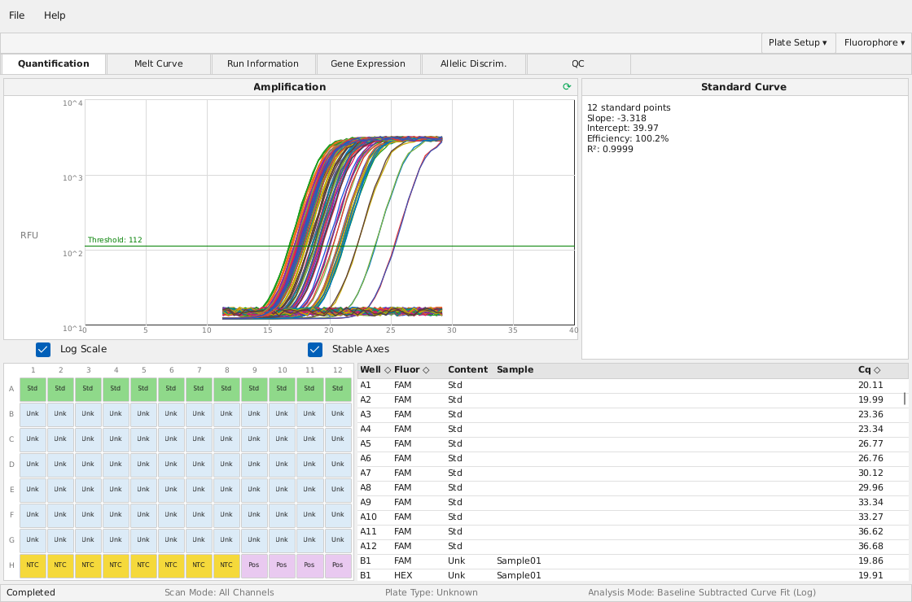
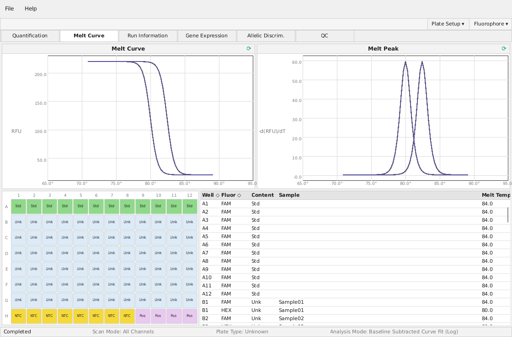
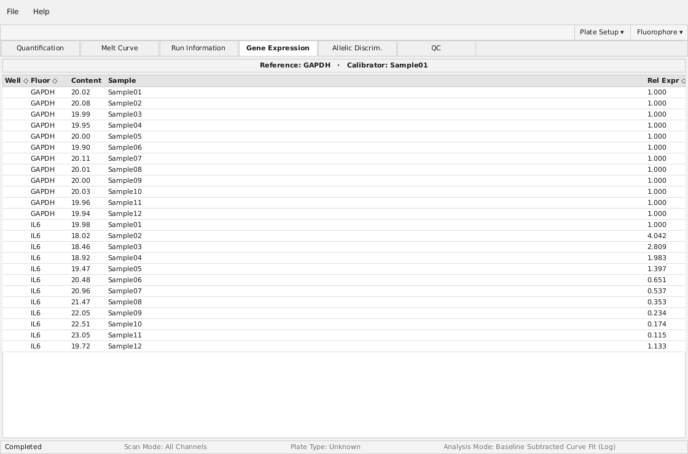
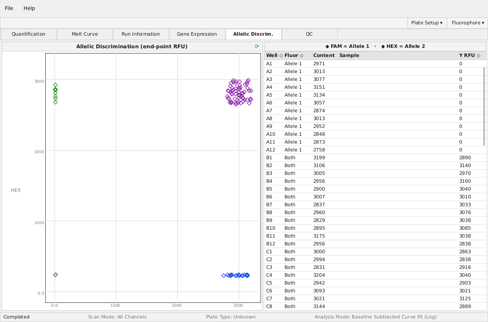
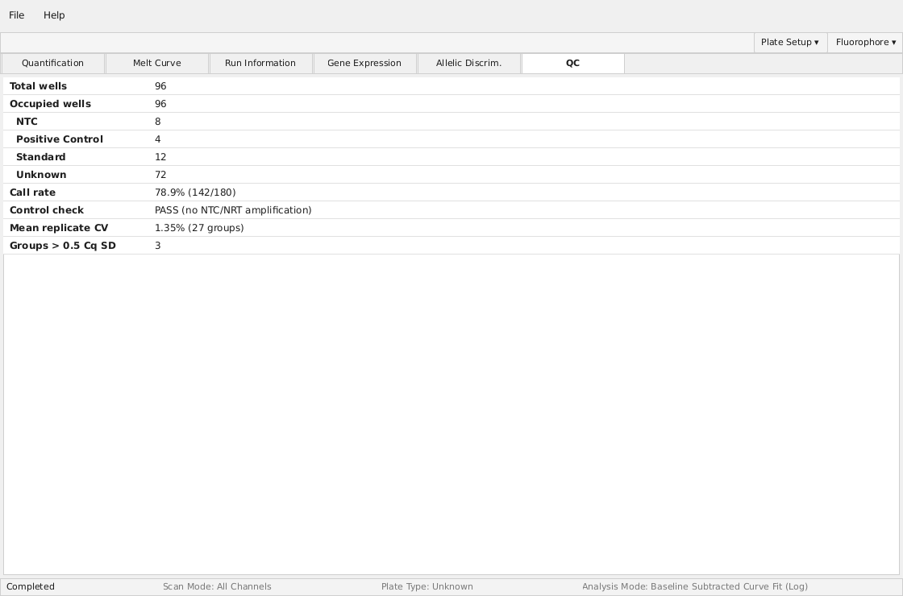
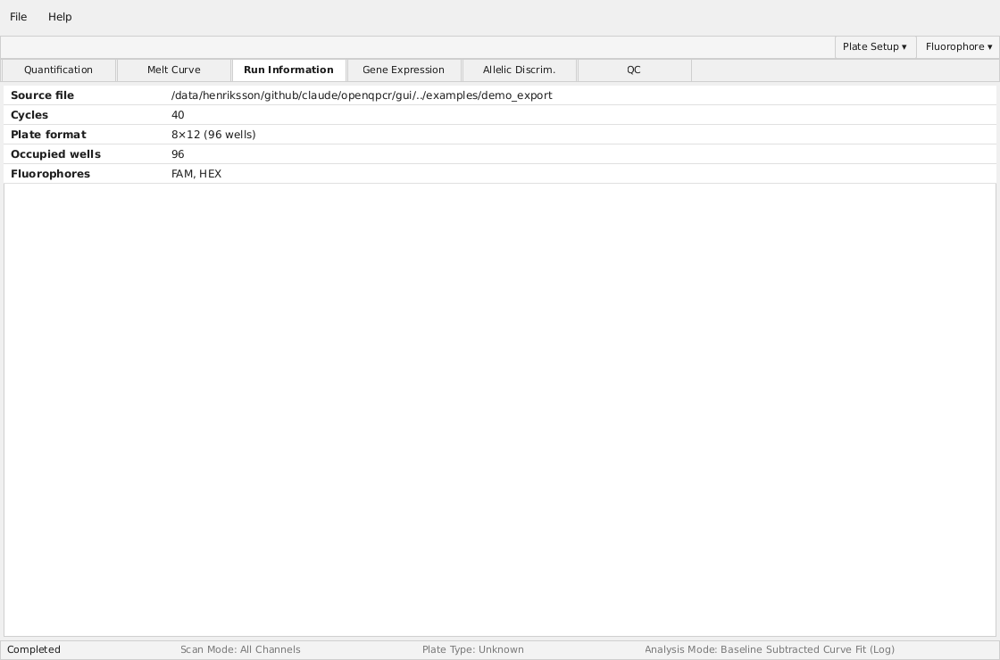
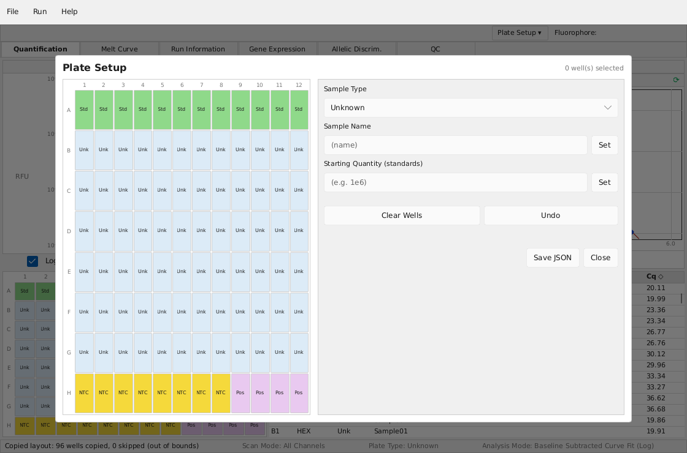

# openqpcr

Open source software for analysis of qPCR data and control of qPCR machines.


Features:

* Cq/Ct calculation
* Melt curves
* Allelic Discrimination analysis
* Replay simulator (play a recorded `.pcrd` back as a live run) (could be expanded to teach students about qPCR)

File format support:

* CFX export reader (CSV + Excel)
* RDML import + export (`.rdml`)

Hardware support:

* Bio-Rad **CFX Connect**, **CFX Duet**, and **CFX Opus** instruments 
* Chai Open qPCR driver  - must be validated
* Support for other instruments can be added (you will have to help run some software on your computer to figure out how the instrument works).

**Still under development**


## GUI

Screenshots below are rendered from the bundled synthetic 96-well demo run — a
two-fluorophore (FAM / HEX) plate with a GAPDH standard curve, a GAPDH+IL6 gene
expression panel, an SNP genotyping block, and controls:

<table>
  <tr>
    <td width="50%"><b>Quantification</b> (with standard curve)<br></td>
    <td width="50%"><b>Melt Curve</b><br></td>
  </tr>
  <tr>
    <td><b>Gene Expression</b> (ΔΔCq relative quantification)<br></td>
    <td><b>Allelic Discrimination</b> (end-point genotyping)<br></td>
  </tr>
  <tr>
    <td><b>QC</b><br></td>
    <td><b>Run Information</b><br></td>
  </tr>
  <tr>
    <td><b>Plate Setup</b> — copy layout (wells copied / skipped)<br></td>
    <td></td>
  </tr>
</table>

```sh
cargo run -p openqpcr-gui -- path/to/export_dir/     # or a .xlsx export
cargo run -p openqpcr-gui                            # loads the bundled demo

# Render a screenshot (needs a display; use xvfb-run on servers).
# Flags compose so GUI actions are exercisable headlessly:
#   --tab 0..5        pick the analysis tab
#   --edit            open the plate-setup editor
#   --protocol-edit   open the protocol editor
#   --copy-layout P   copy the plate layout from run/export P onto the current plate
#   --simulate        drive a synthetic acquisition (animating amplification chart)
#   --replay P        play a recorded run/.pcrd P back as a live acquisition
openqpcr-gui examples/demo_export --tab 0 --screenshot out.png
openqpcr-gui examples/demo_export --copy-layout examples/demo_export --edit --screenshot copy_layout.png
openqpcr-gui --replay experiment.pcrd --tab 0 --screenshot replay.png
```

**Simulators (no hardware).** Two `Instrument` drivers make the whole
run/acquisition/analysis pipeline testable without a device: `SimulatedInstrument`
synthesizes curves from each well's sample type (with optional fault injection —
mid-run errors, dead wells), and `ReplayInstrument` streams a *recorded* run (e.g. a
decoded `.pcrd`) back cycle-by-cycle as if acquiring live. Replaying a run in the GUI:

`examples/gen_demo_export.py` regenerates the synthetic 96-well demo dataset in
`examples/demo_export/`.

## Packaging

A `Makefile` builds and packages both binaries (GUI + CLI):

```sh
make build          # debug build, whole workspace
make release        # optimized build
make test           # cargo test --workspace
make run            # launch the GUI
make install        # Linux: install binaries + .desktop + icons (honors DESTDIR/PREFIX)
make deb            # Linux: build a Debian package (dist/openqpcr_<ver>_<arch>.deb)
make osx-app        # macOS: build openqpcr.app (macOS host only)
```

Windows (`.exe` zip), macOS (`.app` zip), and Linux (`.deb`) release artifacts are
all produced by `.github/workflows/build-artifacts.yml` — uploaded on every push and
attached to GitHub Releases on `v*` tags. The `.deb` bundles both binaries, the
`.desktop` entry, and icons; its runtime `Depends:` are derived from the built
binaries (`ldd` + `dpkg -S`). Icons under `assets/` and `gui/assets/` are
placeholders — replace with a real design.

## Building

```sh
cargo build
cargo test
```

## License

MIT — see [`LICENSE`](LICENSE).

openqpcr is an independent, open-source project. It is **not affiliated with,
authorized, or endorsed by Bio-Rad Laboratories, Inc.** "Bio-Rad", "CFX", "CFX
Maestro", and related names are trademarks of Bio-Rad Laboratories, used here only
nominatively to identify the formats and instruments openqpcr interoperates with.
See [`docs/optics-sources.md`](docs/optics-sources.md) for the public
sources behind the optics reference data. Not a medical device; not for diagnostic use.
